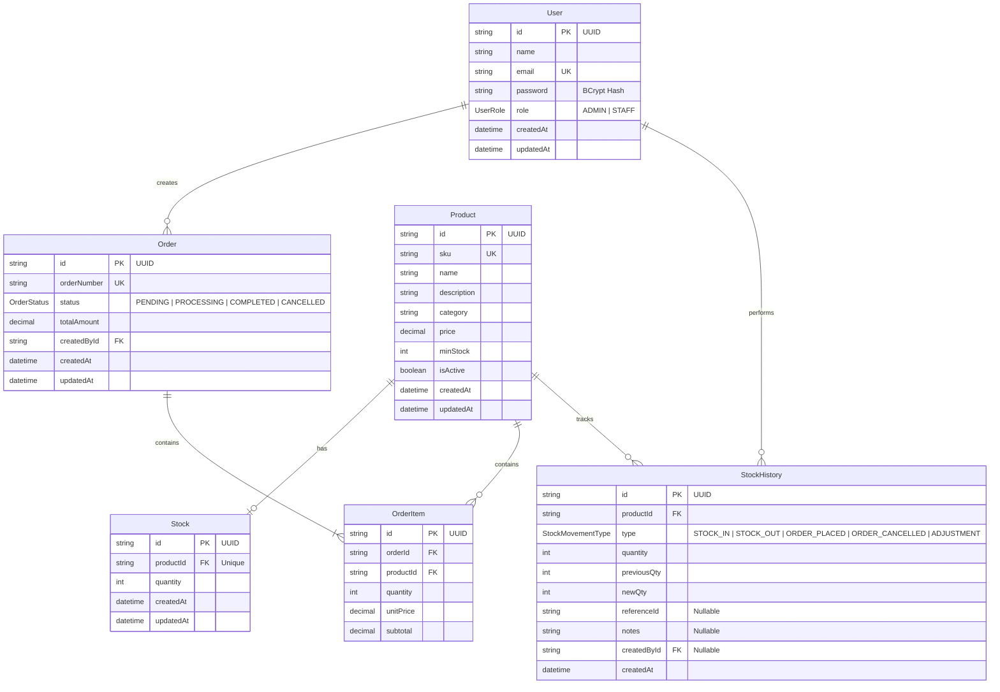

# Inventory Management System - API & Database Schema Documentation

This document serves as the official API Specification and Database Schema layout for the Inventory Management System. The backend is built using Node.js, Express.js, Prisma ORM, and MySQL, with strict schema validation using Zod and secure session management through JWT.

---

## Table of Contents
1. [System Architecture & Core Design](#1-system-architecture--core-design)
2. [Database Schema Specification](#2-database-schema-specification)
   - [Entity-Relationship Diagram](#entity-relationship-diagram)
   - [Data Models & Types](#data-models--types)
3. [Security & Authentication](#3-security--authentication)
4. [API Endpoints Reference](#4-api-endpoints-reference)
   - [Authentication Module](#authentication-module)
   - [Product Management Module](#product-management-module)
   - [Stock Management Module](#stock-management-module)
   - [Order Management Module](#order-management-module)
5. [Business Rules & Transaction Integrity](#5-business-rules--transaction-integrity)
6. [Postman Integration & Testing](#6-postman-integration--testing)

---

## 1. System Architecture & Core Design

The system implements a RESTful service layer with atomic transactions to prevent race conditions and stock inconsistencies.

```
┌─────────────────┐       HTTP Requests        ┌──────────────────────┐
│  React Frontend │ ────────────────────────>  │   Express.js API     │
│  (Vite App)     │ <────────────────────────  │   Server (Port 5020) │
└─────────────────┘       JSON Responses       └──────────────────────┘
                                                          │
                                                          │ Database Operations
                                                          │ (Prisma Client)
                                                          ▼
                                               ┌──────────────────────┐
                                               │      MySQL Database  │
                                               │      (inventory_db)  │
                                               └──────────────────────┘
```

- **Base URL**: `http://localhost:5020/api`
- **Request Format**: `application/json`
- **Response Format**: `application/json`
- **Default Port**: `5020`

---

## 2. Database Schema Specification

### Entity-Relationship Diagram

The schema enforces strict relational integrity constraints. Below is the Mermaid representation of the entities and their relations:



### Data Models & Types

#### 1. User Model
Represents users (Staff/Administrators) who can access the dashboard, adjust stock levels, or manage orders.
- **Fields**:
  - `id` (String/UUID): Primary key, auto-generated.
  - `name` (String): Display name of the user.
  - `email` (String): Unique email used for login.
  - `password` (String): Salted and hashed password.
  - `role` (Enum `UserRole`): Can be `ADMIN` or `STAFF`. Defaults to `STAFF`.
  - `createdAt` / `updatedAt` (DateTime).

#### 2. Product Model
Stores details of the item. Product deletions are handled through soft deletion to preserve history records.
- **Fields**:
  - `id` (String/UUID): Primary key.
  - `name` (String): Name of the product.
  - `sku` (String): Unique Stock Keeping Unit (enforced globally, capitalized on entry).
  - `description` (String, Optional): Product description.
  - `category` (String): Category name (e.g. `Electronics`).
  - `price` (Decimal, 10,2): Unit price of the product.
  - `minStock` (Int): Threshold for low stock warnings (defaults to `5`).
  - `isActive` (Boolean): Soft-deletion flag (defaults to `true`).
  - `createdAt` / `updatedAt` (DateTime).

#### 3. Stock Model
Keeps track of the physical quantities on hand for each product.
- **Fields**:
  - `id` (String/UUID): Primary key.
  - `productId` (String/UUID): Unique reference to the `Product` table.
  - `quantity` (Int): Current physical quantity. Enforced at the code & transaction level to never be less than `0`.
  - `createdAt` / `updatedAt` (DateTime).

#### 4. Order Model
Tracks orders placed through the client application.
- **Fields**:
  - `id` (String/UUID): Primary key.
  - `orderNumber` (String): Unique number matching format `ORD-XXXXXX` (derived from timestamp).
  - `status` (Enum `OrderStatus`): Can be `PENDING`, `PROCESSING`, `COMPLETED` (`delivered` in API output), or `CANCELLED`.
  - `totalAmount` (Decimal, 10,2): Total value of the order.
  - `createdById` (String/UUID): Foreign key referencing the `User` who created the order.
  - `createdAt` / `updatedAt` (DateTime).

#### 5. OrderItem Model
Represents items inside a specific order.
- **Fields**:
  - `id` (String/UUID): Primary key.
  - `orderId` (String/UUID): References `Order`.
  - `productId` (String/UUID): References `Product`.
  - `quantity` (Int): Quantity of the item ordered.
  - `unitPrice` (Decimal, 10,2): Selling price of the item at the moment of order.
  - `subtotal` (Decimal, 10,2): Calculated as `quantity * unitPrice`.

#### 6. StockHistory Model
The double-entry audit trail logging every stock modification. This table is write-only.
- **Fields**:
  - `id` (String/UUID): Primary key.
  - `productId` (String/UUID): References `Product`.
  - `type` (Enum `StockMovementType`):
    - `STOCK_IN`: Standard manual inventory increase.
    - `STOCK_OUT`: Standard manual inventory reduction.
    - `ORDER_PLACED`: Deductions caused by incoming orders.
    - `ORDER_CANCELLED`: Restorations caused by cancelling orders.
    - `ADJUSTMENT`: Adjustments triggered by modifying the product quantity during info updates.
  - `quantity` (Int): Net amount changed (negative for stock-out/deductions, positive for stock-in/restores).
  - `previousQty` (Int): Physical quantity immediately prior to the event.
  - `newQty` (Int): Physical quantity after applying the change.
  - `referenceId` (String, Optional): References the corresponding `Order` id, if applicable.
  - `notes` (String, Optional): Context notes.
  - `createdById` (String/UUID, Optional): References the `User` who initiated the change.
  - `createdAt` (DateTime).

---

## 3. Security & Authentication

Every route under `/api/products`, `/api/stock`, and `/api/orders` requires valid JWT validation.

### Authentication Flow
1. Client POSTs credentials to `/api/auth/login`.
2. Server validates credentials and responds with a JSON payload containing the JWT token and user profile, and sets an `httpOnly` secure cookie containing the token named `InventoryManagementSystemAuthCookie`.
3. For all subsequent protected API requests, the client should send the token in the `Authorization` header:
   ```http
   Authorization: Bearer <JWT_TOKEN>
   ```
4. If authentication fails, the server responds with HTTP `401 Unauthorized`.

---

## 4. API Endpoints Reference

### Authentication Module

#### Login
- **Endpoint**: `POST /api/auth/login`
- **Description**: Authenticate user credentials, set HTTP-Only session cookie, and return JWT.
- **Headers**:
  - `Content-Type: application/json`
- **Request Body (Zod schema: `email` required, `password` min 6 characters)**:
  ```json
  {
    "email": "admin@example.com",
    "password": "admin123"
  }
  ```
- **Responses**:
  - **`200 OK`**:
    ```json
    {
      "user": {
        "id": "1a2b3c4d-5e6f-7g8h-9i0j-1k2l3m4n5o6p",
        "email": "admin@example.com",
        "name": "Administrator",
        "role": "ADMIN"
      },
      "token": "eyJhbGciOiJIUzI1NiIsInR5cCI6IkpXVCJ9...",
      "expiresInDays": 7
    }
    ```
  - **`400 Bad Request`** (Invalid email/password format):
    ```json
    {
      "message": "Invalid input",
      "issues": [ ... ]
    }
    ```
  - **`401 Unauthorized`** (Incorrect credentials):
    ```json
    {
      "message": "Invalid credentials"
    }
    ```

#### Logout
- **Endpoint**: `POST /api/auth/logout`
- **Description**: Clear the authentication cookie.
- **Headers**:
  - `Authorization: Bearer <JWT_TOKEN>`
- **Responses**:
  - **`200 OK`**:
    ```json
    {
      "message": "Logged out successfully"
    }
    ```

---

### Product Management Module

All requests require `Authorization: Bearer <JWT_TOKEN>`.

#### List Active Products
- **Endpoint**: `GET /api/products`
- **Description**: Fetch all active products (`isActive == true`) and their stock levels.
- **Responses**:
  - **`200 OK`**:
    ```json
    [
      {
        "id": "7864b2ac-6f81-4cd4-bf45-be02fa9bc5e6",
        "sku": "PROD-LAP-001",
        "name": "Ultra Slim Laptop",
        "category": "Electronics",
        "minStock": 5,
        "description": "High performance laptop",
        "price": 1299.99,
        "quantity": 15,
        "isActive": true,
        "createdAt": "2026-06-24T05:00:00.000Z",
        "updatedAt": "2026-06-24T05:00:00.000Z"
      }
    ]
    ```

#### Create Product
- **Endpoint**: `POST /api/products`
- **Description**: Add a new product to the catalog, initialize stock, and write a starting history trail. Evaluated in a single transaction.
- **Request Body (Zod schema: `sku`, `name`, `category`, `price`, `quantity`, `minStock` mandatory; `description` optional)**:
  ```json
  {
    "sku": "PROD-LAP-001",
    "name": "Ultra Slim Laptop",
    "category": "Electronics",
    "price": 1299.99,
    "quantity": 15,
    "minStock": 5,
    "description": "High performance laptop"
  }
  ```
- **Responses**:
  - **`201 Created`**:
    ```json
    {
      "message": "Ultra Slim Laptop added successfully.",
      "product": {
        "id": "7864b2ac-6f81-4cd4-bf45-be02fa9bc5e6",
        "sku": "PROD-LAP-001",
        "name": "Ultra Slim Laptop",
        "category": "Electronics",
        "minStock": 5,
        "description": "High performance laptop",
        "price": 1299.99,
        "quantity": 15,
        "isActive": true,
        "createdAt": "2026-06-24T05:10:00.000Z",
        "updatedAt": "2026-06-24T05:10:00.000Z"
      }
    }
    ```
  - **`400 Bad Request`**:
    ```json
    {
      "message": "Invalid product input",
      "issues": [ ... ]
    }
    ```
  - **`409 Conflict`** (SKU is already taken):
    ```json
    {
      "message": "SKU already exists. Each product must have a unique SKU."
    }
    ```

#### Update Product Details
- **Endpoint**: `PUT /api/products/:id`
- **Description**: Update details of a product. If the quantity field differs from current stock, it adjusts stock and logs a `StockHistory` event with type `ADJUSTMENT`.
- **Request Body**: (Same format as Create Product)
  ```json
  {
    "sku": "PROD-LAP-001",
    "name": "Ultra Slim Laptop V2",
    "category": "Electronics",
    "price": 1349.99,
    "quantity": 20,
    "minStock": 5,
    "description": "Updated high performance laptop"
  }
  ```
- **Responses**:
  - **`200 OK`**:
    ```json
    {
      "message": "Ultra Slim Laptop V2 updated successfully.",
      "product": {
        "id": "7864b2ac-6f81-4cd4-bf45-be02fa9bc5e6",
        "sku": "PROD-LAP-001",
        "name": "Ultra Slim Laptop V2",
        "category": "Electronics",
        "minStock": 5,
        "description": "Updated high performance laptop",
        "price": 1349.99,
        "quantity": 20,
        "isActive": true,
        "createdAt": "2026-06-24T05:10:00.000Z",
        "updatedAt": "2026-06-24T05:15:00.000Z"
      }
    }
    ```
  - **`404 Not Found`**:
    ```json
    {
      "message": "Product not found."
    }
    ```
  - **`409 Conflict`** (New SKU conflicts with another product):
    ```json
    {
      "message": "SKU already exists. Each product must have a unique SKU."
    }
    ```

#### Delete Product (Soft Delete)
- **Endpoint**: `DELETE /api/products/:id`
- **Description**: Flag `isActive` to `false`. Blocks deletion if the product exists in active `PENDING` orders.
- **Responses**:
  - **`200 OK`**:
    ```json
    {
      "message": "Ultra Slim Laptop V2 deleted successfully."
    }
    ```
  - **`404 Not Found`**:
    ```json
    {
      "message": "Product not found."
    }
    ```
  - **`409 Conflict`** (Assigned to active order items):
    ```json
    {
      "message": "This product appears in active orders and cannot be deleted."
    }
    ```

---

### Stock Management Module

All requests require `Authorization: Bearer <JWT_TOKEN>`.

#### Get Stock History (Audit Logs)
- **Endpoint**: `GET /api/stock/history`
- **Description**: Fetch all audit records of stock movements. Sorts by most recent movements first.
- **Responses**:
  - **`200 OK`**:
    ```json
    [
      {
        "id": "9a8b7c6d-5e4f-3g2h-1i0j-k9l8m7n6o5p4",
        "pid": "7864b2ac-6f81-4cd4-bf45-be02fa9bc5e6",
        "name": "Ultra Slim Laptop",
        "action": "stock_added",
        "qty": 10,
        "note": "Manual restock from supplier",
        "ts": "2026-06-24T05:30:00.000Z",
        "previousQty": 15,
        "newQty": 25
      }
    ]
    ```

#### Adjust Stock (Manual Addition or Reduction)
- **Endpoint**: `POST /api/stock/adjust`
- **Description**: Manually adjust stock. Enforces check to prevent stock from falling below `0`.
- **Request Body (Zod schema: `productId`, `mode` [add|reduce], `quantity` [positive integer] required; `note` optional)**:
  ```json
  {
    "productId": "7864b2ac-6f81-4cd4-bf45-be02fa9bc5e6",
    "mode": "add",
    "quantity": 10,
    "note": "Manual restock from supplier"
  }
  ```
- **Responses**:
  - **`200 OK`**:
    ```json
    {
      "message": "Ultra Slim Laptop stock increased successfully."
    }
    ```
  - **`400 Bad Request`** (Invalid inputs or results in negative stock):
    ```json
    {
      "message": "Stock cannot go below zero."
    }
    ```
  - **`404 Not Found`** (Invalid product ID or inactive product):
    ```json
    {
      "message": "Product not found."
    }
    ```

---

### Order Management Module

All requests require `Authorization: Bearer <JWT_TOKEN>`.

#### List Orders
- **Endpoint**: `GET /api/orders`
- **Description**: Fetch a list of all orders, sorted by date in descending order.
- **Responses**:
  - **`200 OK`**:
    ```json
    [
      {
        "id": "e4f5a6b7-c8d9-0e1f-2a3b-4c5d6e7f8a9b",
        "orderNumber": "ORD-456789",
        "status": "pending",
        "total": 2599.98,
        "createdAt": "2026-06-24T05:20:00.000Z",
        "updatedAt": "2026-06-24T05:20:00.000Z",
        "notes": "First client order",
        "items": [
          {
            "pid": "7864b2ac-6f81-4cd4-bf45-be02fa9bc5e6",
            "name": "Ultra Slim Laptop",
            "qty": 2,
            "price": 1299.99
          }
        ]
      }
    ]
    ```

#### Create Order
- **Endpoint**: `POST /api/orders`
- **Description**: Create a new order. Decrements product quantities and creates history logs inside a transactional lock. Prevents duplication of items in the request body.
- **Request Body (Zod schema: `items` [array, min length 1], with each item containing `pid` and `qty` [positive integer])**:
  ```json
  {
    "items": [
      {
        "pid": "7864b2ac-6f81-4cd4-bf45-be02fa9bc5e6",
        "qty": 2
      }
    ],
    "note": "First client order"
  }
  ```
- **Responses**:
  - **`201 Created`**:
    ```json
    {
      "message": "Order ORD-456789 created successfully.",
      "order": {
        "id": "e4f5a6b7-c8d9-0e1f-2a3b-4c5d6e7f8a9b",
        "orderNumber": "ORD-456789",
        "status": "pending",
        "total": 2599.98,
        "createdAt": "2026-06-24T05:20:00.000Z",
        "updatedAt": "2026-06-24T05:20:00.000Z",
        "notes": "",
        "items": [
          {
            "pid": "7864b2ac-6f81-4cd4-bf45-be02fa9bc5e6",
            "name": "Ultra Slim Laptop",
            "qty": 2,
            "price": 1299.99
          }
        ]
      }
    }
    ```
  - **`400 Bad Request`** (Duplicate product IDs, non-existent products, or insufficient stock):
    ```json
    {
      "message": "Insufficient stock for \"Ultra Slim Laptop\". Available: 1."
    }
    ```

#### Cancel Order
- **Endpoint**: `PATCH /api/orders/:id/cancel`
- **Description**: Cancel a pending/processing order, restore stock items to inventory, and log the action to `StockHistory`. Run inside a `$transaction` lock.
- **Responses**:
  - **`200 OK`**:
    ```json
    {
      "message": "Order ORD-456789 cancelled and stock restored.",
      "order": {
        "id": "e4f5a6b7-c8d9-0e1f-2a3b-4c5d6e7f8a9b",
        "orderNumber": "ORD-456789",
        "status": "cancelled",
        "total": 2599.98,
        "createdAt": "2026-06-24T05:20:00.000Z",
        "updatedAt": "2026-06-24T05:40:00.000Z",
        "notes": "",
        "items": [
          {
            "pid": "7864b2ac-6f81-4cd4-bf45-be02fa9bc5e6",
            "name": "Ultra Slim Laptop",
            "qty": 2,
            "price": 1299.99
          }
        ]
      }
    }
    ```
  - **`404 Not Found`**:
    ```json
    {
      "message": "Order not found."
    }
    ```
  - **`409 Conflict`** (Order status is completed or already cancelled):
    ```json
    {
      "message": "Only pending or processing orders can be cancelled."
    }
    ```

#### Update Order Status
- **Endpoint**: `PATCH /api/orders/:id/status`
- **Description**: Update status of an order. Options are `pending`, `processing`, `delivered` (`COMPLETED`), or `cancelled` (`CANCELLED`). Moving to `cancelled` will trigger stock restoration and log movement events.
- **Request Body**:
  ```json
  {
    "status": "processing"
  }
  ```
- **Responses**:
  - **`200 OK`**:
    ```json
    {
      "message": "Order ORD-456789 status updated to processing.",
      "order": {
        "id": "e4f5a6b7-c8d9-0e1f-2a3b-4c5d6e7f8a9b",
        "orderNumber": "ORD-456789",
        "status": "processing",
        "total": 2599.98,
        "createdAt": "2026-06-24T05:20:00.000Z",
        "updatedAt": "2026-06-24T05:45:00.000Z",
        "notes": "",
        "items": [
          {
            "pid": "7864b2ac-6f81-4cd4-bf45-be02fa9bc5e6",
            "name": "Ultra Slim Laptop",
            "qty": 2,
            "price": 1299.99
          }
        ]
      }
    }
    ```
  - **`400 Bad Request`** (Invalid status input, or trying to modify completed/cancelled orders):
    ```json
    {
      "message": "Cannot change status of a cancelled order."
    }
    ```
  - **`404 Not Found`**:
    ```json
    {
      "message": "Order not found."
    }
    ```

---

## 5. Business Rules & Transaction Integrity

### 1. Atomic Transaction Blocks
Every mutation endpoint (`createProduct`, `updateProduct`, `adjustStock`, `createOrder`, `cancelOrder`, `updateOrderStatus`) leverages Prisma's `$transaction` utility to bundle queries into a single database unit. If any sub-operation fails (e.g., integrity check, validation issue), the entire stack rolls back.

### 2. Negative Stock Protection
Stock calculations are checked in sequence. Before decreasing stock, the system evaluates:
```javascript
const newQty = previousQty - quantity;
if (newQty < 0) {
  throw new Error("Stock cannot go below zero.");
}
```
At the database engine level, an updates statement is applied using increment/decrement syntax which blocks updates in case other simultaneous threads try to fetch and exhaust quantities.

### 3. Double-Entry Audit History
Any change to physical stock (orders, cancellations, product updates, adjustments) triggers a row write to the `StockHistory` table containing the exact change quantity delta, preceding quantity, and final quantity.

---

## 6. Postman Integration & Testing

For API testing, import the Postman collection located at:
`docs/postman_collection.json`

### Variables
- `{{base_url}}`: Path to the service (`http://localhost:5020/api` by default).
- `{{token}}`: Paste the JWT string returned by `/auth/login` to authenticate protected API calls.

### Collection Folders
1. **Authentication**: Contains Login and Logout requests.
2. **Products**: Contains List, Create, Update, and Delete Product requests.
3. **Stock**: Contains Get Stock History and Adjust Stock requests.
4. **Orders**: Contains List Orders, Create Order, Cancel Order, and Update Order Status requests.
